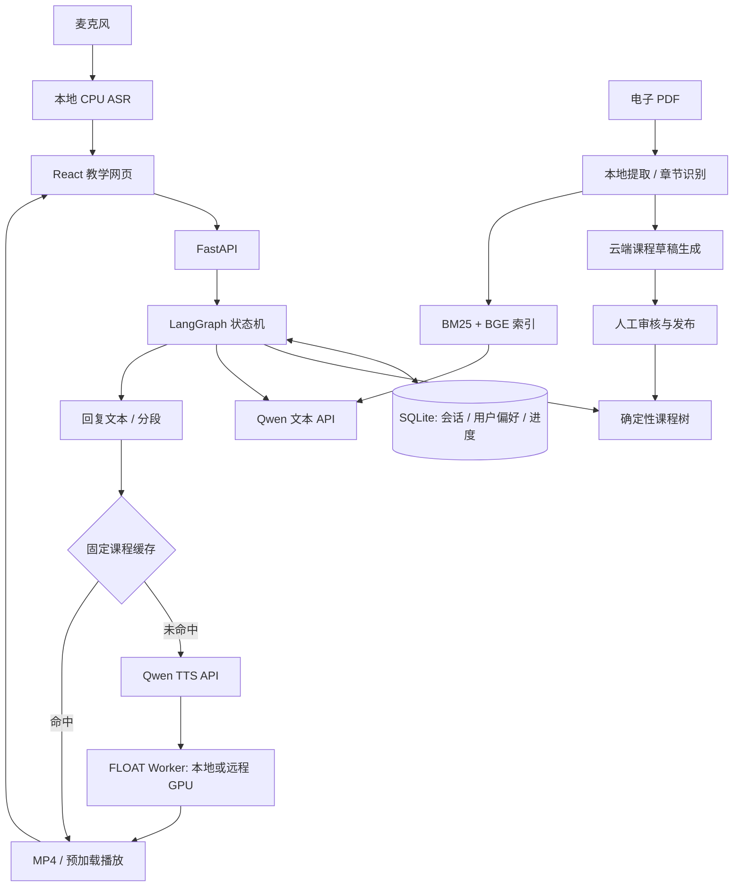

# Virtual Teacher · 虚拟教师

基于 **LangGraph + React + FastAPI** 的本地优先虚拟教师演示项目：
从 PDF 教材生成可审核、可复用的课程，结合教材检索回答临时提问，
通过语音和说话人视频呈现教学内容。

支持单纯文本体验，也支持 **Qwen 文本/TTS API + 独立 FLOAT GPU Worker**。
面向学习、研究与项目展示；不是医疗系统，也不是生产级在线教育平台。


*示例人像由 majicMIX realistic v7 生成，不是真实教师照片。图片来源与许可说明见
[展示素材](assets/README.md)。本仓库不包含麦橘模型权重。*

## 可以做什么

- **自由问答**：历史会话恢复、同会话上下文、用户偏好；支持动态连续讲授和暂停后提问。
- **固定课程**：自动讲授、检查题按钮、互动练习；课程中可临时提问，之后继续原课程。
- **PDF → 课程**：电子教材整本导入、章节识别、逐章生成草稿、人工编辑审核、发布/下架/删除。
- **教材 RAG**：BM25 + 本地 BGE 语义检索，融合排序，回答展示教材原始 PDF 页码。
- **本地语音输入**：CPU SenseVoiceSmall INT8，录音→识别→编辑→手动发送，无云端 ASR 费用。
- **说话视频**：Qwen TTS→FLOAT；句子切分、串行 GPU 队列、视频预加载、跳过视频、媒体失败重试。
- **确定性媒体缓存**：固定课程的确定内容可复用 TTS/FLOAT 结果；自由问答与动态讲授不复用课程缓存。
- **本地/远程推理**：Web 和 FLOAT 环境分离；远程 Worker 通过 SSH 隧道接入。

固定课程正常推进仍经过 LangGraph 状态机，**不代表调用语言模型**。
课程草稿生成、自由问答、动态讲授和课堂临时提问才需要语言模型；
首次语音/视频生成仍可能产生 TTS 费用。缓存命中与否取决于内容、配置和文件是否完整。

## 系统结构



LangGraph 管理的是状态、路由与持久化，不会自动让模型拥有无限记忆；
历史、偏好及检索片段由应用选择后放入每次模型请求。RAG 是文本混合检索，不是知识图谱。

## 快速开始：先运行无 FLOAT 版本

已验证开发环境：Windows 11、Python 3.10、Node.js 24。
**尚未进行全新环境安装验证**；依赖与已用版本见 [环境说明](docs/environment.md)。
以下操作供新用户安装参考，本仓库不附带任何 Conda 环境。

在下载后的项目根目录、已激活的 Python 3.10 环境中执行：

```powershell
python -m pip install -r requirements.txt
Copy-Item .env.example .env
cd frontend
npm ci
npm run build
cd ..
python -m app.launch web
```

若已有 .env，请保留原配置，不要覆盖。打开 http://127.0.0.1:8000/。
也可使用 `python -m app.launch web --port 8001` 指定端口。

默认 `VT_LLM_MODE=rule` 是**离线规则演示**：不需要 API Key，可查看界面、固定课程和
PDF 提取，不能代表真实问答质量，也不能生成 AI 课程草稿。先不要勾选生成说话视频。
教师图片可以显示，没有待机视频时使用静态图。

Node.js 仅用于前端构建和开发；生产网页由 Python 服务提供，不需要常驻 npm 开发服务。

## 接入千问文本与 TTS

在 .env 中填写你自己的配置：

```env
VT_LLM_MODE=qwen
VT_QWEN_API_KEY=填写你自己的APIKey
VT_QWEN_BASE_URL=https://dashscope.aliyuncs.com/compatible-mode/v1
VT_QWEN_MODEL=qwen3.7-flash
VT_QWEN_TTS_BASE_URL=https://dashscope.aliyuncs.com/api/v1
VT_QWEN_TTS_MODEL=qwen3-tts-instruct-flash
VT_QWEN_TTS_VOICE=Cherry
```

模型名称是开发时使用的示例，不保证在所有账户或地域可用。按[百炼文档](https://help.aliyun.com/zh/model-studio/)
选择你的模型与地域地址；TTS 和文本 Key 可在对应权限有效时共用。改配置后重启 Web。

API 会产生费用；自己的 Key 留在本地服务端，不写进前端或 Git。
启用完整模型请求日志需设置 `VT_LLM_DEBUG=true`，日志可能含用户与教材正文。
查看最近一次输入输出：`python -m app.trace_viewer --last 1`。

## 可选：本地语义检索与语音输入

两者均装在 **Web 环境**，不是新增两个环境。

```powershell
# 语义检索（CPU；仅关键词 BM25 检索不需要这些额外依赖）
python -m pip install -r requirements-rag.txt
# 本地 ASR
python -m pip install -r requirements-asr.txt
python scripts/maintenance/download_asr_model.py
```

BGE 权重需另行下载并配置路径，操作见 [RAG 指南](docs/rag.md)；
ASR 下载脚本只下载 INT8 模型等必要文件，详见 [ASR 指南](docs/asr.md)。
不需要 Ollama，也不需要克隆独立的 LangGraph/RAG 项目。
模型不会随 GitHub 源码一起发布。

## 可选：本地 FLOAT 视频

1. 按 [FLOAT 上游 README](https://github.com/deepbrainai-research/float) 独立安装环境、代码和权重，
   先确认原项目能正常推理。不要把其依赖混装进 Web 环境。
2. 在 FLOAT 环境安装本适配器依赖：
   `python -m pip install -r deploy/remote_float_worker/requirements.txt`（从本项目根目录运行）。
3. 在本项目 .env 设置 `VT_FLOAT_ROOT` 和 `VT_FLOAT_PYTHON`（FLOAT 环境的 Python 路径）。
   不设置解释器路径时尝试 `conda run -n FLOAT`。
4. 用 Web 环境运行 `python -m app.launch worker`，等待 http://127.0.0.1:8011/health 返回 ready。
5. 另开 Web 环境终端运行 `python -m app.launch web`。Web 配置为
   `VT_FLOAT_WORKER_URL=http://127.0.0.1:8011`、`VT_FLOAT_TRANSFER_MODE=path`。

默认示例提供原始人像和已对齐的静态图。换形象时同时检查视频与静态图构图；待机视频可自行配置。
8GB GPU 可试运行，但速度和显存/内存占用与音频长度有关，不承诺实时。
Worker 常驻加载模型，会占显存；使用结束关闭 Worker 即可释放。不默认注册开机自启动。

## 可选：远程 FLOAT

先构建 Worker 上传包（**不含环境和权重**）：

```powershell
powershell -NoProfile -ExecutionPolicy Bypass -File scripts/maintenance/build_remote_worker_bundle.ps1
```

把输出目录内容传到你自己的服务器，按 [远程部署指南](deploy/remote_float_worker/README.md)
配置 FLOAT 路径、环境、**分配给你的物理 GPU 编号**、端口并启动 Screen。
模板不默认占用任何 GPU，必须显式配置。

在本机建立 SSH 隧道后设置：

```env
VT_FLOAT_WORKER_URL=http://127.0.0.1:18011
VT_FLOAT_TRANSFER_MODE=upload
```

Web 端口和 Worker 端口是两回事；Web 使用配置中的那个后端，不自动在本地/远程间切换。
需要一键启动远程服务与隧道时使用 [远程脚本组](scripts/remote_float/README.md)。
关闭 SSH 隧道不会自动关闭 Screen 里的 Worker，需要另外停止才能释放服务器显存。

## PDF 创建课程与教材问答

1. 上传有文字层且有权使用的 PDF，确认自动识别的章节及页码。
2. 选择章节生成草稿；系统按主要小节建议课时、按容量分批请求，不默认一次生成整本书。
3. 人工检查讲稿、选项、答案与出处后发布；发布本身不调用模型。
4. 在教学模式选择新课程，开始连续讲授；首次媒体生成后确定内容进入缓存。
5. 为教材建立问答索引，课中点击“向老师提问”，查看回答下方的检索页码。
6. 从“管理课程”统一修改、下架或删除草稿/课程。

章节识别与文本提取在本地进行。**生成草稿会把选定正文发送给云端模型**；
教材问答会发送命中的正文片段。请先确认资料允许这样使用。
扫描页 OCR、完整公式/图表理解尚未实现，页码校验不等于事实正确性验证。
详见 [课程生成指南](docs/course-builder.md)。

## 启动脚本与开发验证

Windows 脚本按模式分组并标出顺序：[脚本导航](scripts/README.md)。
可选个人解释器配置方式见 [环境说明](docs/environment.md)。

```powershell
python -m unittest discover -s tests -v
cd frontend
npm run lint
node --experimental-strip-types --test tests/audio-recorder.test.mjs
npm run build
```

完整离线发布检查：`powershell -ExecutionPolicy Bypass -File scripts/maintenance/run_release_checks.ps1`。
默认检查使用假模型，不调用付费 API、不运行 FLOAT。

## 性能与已知边界

一次真实 RTX 4090 课程测试：10 段、178 秒视频，FLOAT 推理累计 140.919 秒，
**视频时长 / 推理耗时 = 1.263×**；第一段就绪后用户观察到连续播放。
这不是首包延迟或端到端实时率：该轮 TTS 累计约 51 秒，首次等待仍然明显。
只代表一次应用场景测量，非平均性能保证。[详细记录](docs/performance-results.md)

- 本地可信用户演示，没有生产级认证、权限隔离和高并发保障，不要直接部署到公网。
- 云模型输出、发音及课程覆盖率需要人工检查；不承诺教学、诊断或治疗效果。
- 当前跨轮次预生成容量有限；页面关闭不保证取消已发出的云调用/GPU 任务。
- ASR 是按钮录音，不是实时流式全双工；尚无自动 VAD 打断。
- SQLite/NumPy 检索适合少量教材，未实现大规模向量数据库或知识图谱。
- 源码发布不等于免安装整合包；跨设备、干净环境及长期负载验证仍待补充。

## 许可证与发布范围

原创软件与文档采用 [MIT](LICENSE)；示例图片单独说明。第三方项目、模型和服务遵守各自条款，
尤其接入 FLOAT 不因本项目 MIT 而获得商业使用许可。见 [第三方说明](THIRD_PARTY_NOTICES.md)。

源码不包含 API Key、个人 SSH 参数、Conda 环境、模型权重、教材 PDF、用户历史或生成视频缓存。
从开发工作区发布时使用 [发布检查清单](docs/release-checklist.md) 的独立源码导出流程，
不要直接推送私人开发历史。安全边界见 [SECURITY.md](SECURITY.md)。
